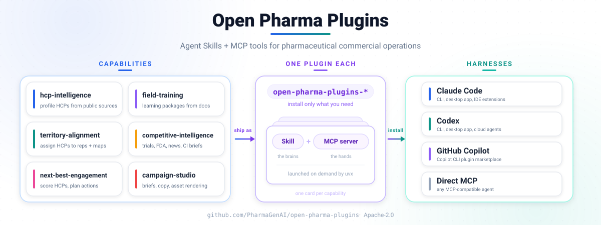

# Open Pharma Plugins

Agent Skills and MCP tools for pharmaceutical commercial operations.

> **Public beta.** Validate outputs before operational use. Campaign and field-training artifacts are drafts for qualified medical/legal/regulatory review, not automated approval.

The public business site at [pharmagenai.github.io](https://pharmagenai.github.io/) is the external product and company overview. Technical installation, capability, testing, and release documentation for operators and maintainers lives in this repository under [`docs/`](docs/) and the capability cookbooks, alongside the source code.

## Capabilities

| Capability | Tools | Description |
|---|---:|---|
| [HCP Intelligence](cookbooks/hcp-intelligence/usage.md) | 11 | Build evidence-backed HCP/HCO profiles from public sources |
| [Field Training](cookbooks/field-training/usage.md) | 5 | Turn approved PDF/PPTX paths into grounded learning packages, assessments, role-play kits, and scorecards |
| [Campaign Studio](cookbooks/campaign-studio/usage.md) | 16 | Create, validate, render, and export campaign drafts for MLR review |
| [Next-Best-Engagement](cookbooks/next-best-engagement/usage.md) | 3 | Score HCPs and produce consent-aware engagement plans |
| [Territory Alignment](cookbooks/territory-alignment/usage.md) | 6 | Compare HCP-to-rep assignments and plan visit clusters |
| [Competitive Intelligence](cookbooks/competitive-intelligence/usage.md) | 12 | Collect one evidence run and project reproducible briefings and timelines |

## Architecture

<p align="center"></p>

Each source plugin bundles a Skill with one MCP server. The Python wheel contains the six MCP servers and their runtime fixtures; Skills, cookbooks, and marketplace manifests are installed from the repository rather than the wheel.

## Quick start

Python 3.10–3.13 is supported. Install one or more MCP servers from the published distribution:

```bash
python -m pip install "open-pharma-plugins[territory-alignment,competitive-intelligence]"
open-pharma-plugins-territory-alignment --version
```

For the complete Skill + MCP plugin, download and inspect the guided installer before running it:

```bash
curl -fsSLO https://raw.githubusercontent.com/PharmaGenAI/open-pharma-plugins/main/install.sh
less install.sh
bash install.sh
```

The installer supports Claude Code, Codex, and GitHub Copilot CLI. It requires `uv`/`uvx` and never installs a package manager on your behalf. See [Installation](docs/en/installation.md) for tag-pinned and source-checkout options.

## Configuration and local data

Copy `.env.example` to `~/.open-pharma-plugins/config` and set only the providers you use. Process environment variables take precedence. Mutable data defaults to private capability directories under `~/.open-pharma-plugins`; files are written with mode `0600` and directories with `0700` where POSIX permissions are available.

Common settings include:

| Variable | Used by |
|---|---|
| `SERPER_API_KEY` / `TAVILY_API_KEY` / `EXA_API_KEY` | Web search |
| `OPENROUTER_API_KEY` / `OPENROUTER_BASE_URL` | Optional HCP batch profile synthesis |
| `NCBI_API_KEY` | PubMed |
| `OPENFDA_API_KEY` | openFDA |
| `OPEN_PHARMA_*_DIR` | Capability-specific mutable-data locations |

API keys are not persisted in competitive-intelligence cache metadata, evidence URLs, runs, or reports. Source queries are still sent to the selected external provider, so do not place secrets or unnecessary personal data in search terms. Reports and timelines can reuse one immutable run instead of repeating provider calls.

HCP batch extraction/synthesis defaults to `high` reasoning effort, a 120-second request timeout,
and zero SDK retries. An installed HCP plugin accepts user-supplied input/output paths through the
tag-pinned `open-pharma-plugins-hcp-batch` console and produces canonical account JSON,
`batch_summary.csv`, and `batch_manifest.json`. See the
[HCP batch guide](docs/en/hcp_batch.md) for dry-run, confirmation, provider, CSV, and resume rules.

## Documentation

- [Public business site](https://pharmagenai.github.io/) for external product and company overview
- [Technical documentation in this repository](docs/) for installation, capability, testing, and release instructions
- [Installation](docs/en/installation.md)
- [Configuration](docs/en/configuration.md)
- [HCP batch processing and CSV review](docs/en/hcp_batch.md)
- [Data security and compliance boundaries](docs/en/data_security.md)
- [Local development](docs/en/local_development.md)
- [Testing](docs/en/testing.md)
- [Adding a capability](docs/en/how_to_add_new_capability.md)
- [Releasing](docs/en/releasing.md)
- [Manual harness setup](docs/en/manual_harnesses.md)
- [Chinese documentation](docs/zh/) · [Japanese documentation](docs/jp/)

## License

Apache-2.0. See [LICENSE](LICENSE).
